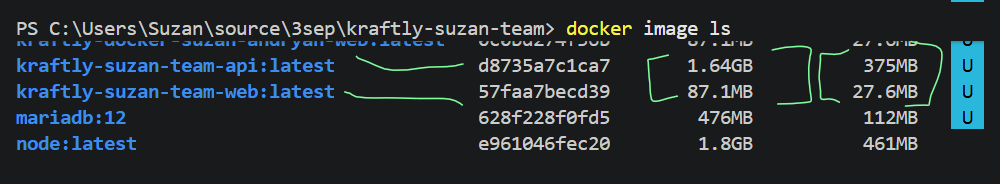
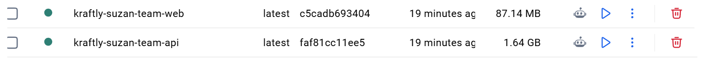
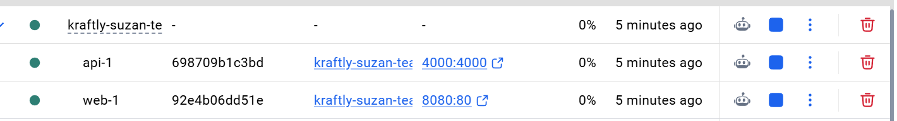

# Containers

## Projektet kan startas med Docker Compose från projektets rotmapp.

```bash
docker compose up --build
```

Detta bygger och startar både frontend och mock-API.

Frontend kan sedan öppnas i webbläsaren på:

```text
http://localhost:8080
```

Mock-API:t körs på port `4000`.
För att stoppa containrarna:

```bash
docker compose down
```

### Köra från ett rent klon

Efter en ny kloning av projektet kan hela miljön startas med:

```bash
docker compose up --build
```

Ingen lokal Node.js-installation eller separat installation av mock-API:t krävs för att starta Docker-miljön.

---

## Docker-arkitektur

Projektet består av två Docker Compose-services:

- `web` – bygger frontend och serverar de färdiga filerna med Nginx.
- `api` – kör mock-API:t med Node.js och Express.
  `web` exponeras på `localhost:8080` och `api` på port `4000`.

```text
Webbläsare
    |
    v
localhost:8080
    |
    v
 Nginx (web)
    |
    | /api/
    v
 api:4000
    |
    v
Mock-API (Node + Express)
```

---

## Image-storlek

Vi mätte Docker-imagernas storlek lokalt med:

```bash
docker image ls
```





Vi jämförde en naiv build med vår multi-stage-build.

| Image                           | Build             | DISK USAGE |
| ------------------------------- | ----------------- | ---------: |
| `kraftly-suzan-team-api:web`    | Naiv build        |    1.64 GB |
| `kraftly-suzan-team-web:latest` | Multi-stage build |    87.1 MB |

**DISK USAGE** är den storlekskolumn som används för M3:s krav.


Web-imagen är **87.1 MB**, vilket är under M3-kravet på **100 MB**.

Skillnaden beror framför allt på hur den slutliga imagen byggs. En naiv Node-baserad image innehåller Node.js, `node_modules`, källkod och byggmiljö. I multi-stage-builden används Node.js endast under byggsteget.

Den slutliga web-imagen innehåller endast de färdigbyggda frontend-filerna och Nginx. Därmed finns varken Node.js eller `node_modules` kvar i den färdiga frontend-imagen.

### Multi-stage-build

Rootens `Dockerfile` använder två steg:

1. **Build-steg** – Node.js används för att installera dependencies och bygga frontend.
2. **Serveringssteg** – Nginx används för att servera innehållet från `dist`.

```dockerfile
FROM node:22-alpine AS build
WORKDIR /app
COPY package*.json ./
RUN npm ci
COPY . .
RUN npm run build

FROM nginx:1.27-alpine
COPY nginx.conf /etc/nginx/conf.d/default.conf
COPY --from=build /app/dist /usr/share/nginx/html
EXPOSE 80
```

Det innebär att byggmiljön inte följer med till den slutliga imagen.
---

## Tre containerbeslut

### 1. Basimage

Vi använder `node:22-alpine` som basimage för byggsteget.
Den slutliga frontend-imagen använder:

```text
nginx:1.27-alpine
```

Vi valde Alpine-baserade images eftersom de är relativt små. Vi använder dessutom en multi-stage-build för att hålla Node.js, `node_modules` och övrig byggmiljö utanför den slutliga frontend-imagen.

Mock-API:t använder också:

```text
node:22-alpine
```

Eftersom mock-API:t inte behöver något separat byggsteg körs Node.js direkt i API-containern.
---

### 2. Hur mock-API:t körs

Mock-API:t körs som en separat service i Docker Compose.
Servicen byggs med:

```compose.yaml
api:
  build:
    context: .
    dockerfile: mock-api/Dockerfile
```

Mock-API:ts Dockerfile är:

```Dockerfile
FROM node:22-alpine
WORKDIR /app
COPY package*.json ./
RUN npm ci
COPY mock-api ./mock-api
EXPOSE 4000
CMD ["node", "mock-api/server.js"]
```

API:t startas alltså med:

```bash
node mock-api/server.js
```

Containern lyssnar på port `4000`.

Mock-API:t är separat från frontend-containern. Det gör att frontend och API kan byggas, startas och kommunicera som separata services i Docker Compose.
---

### 3. Hur webbläsaren når API:t

Webbläsaren ansluter till frontend via:

```text
http://localhost:8080
```

Nginx serverar frontend och skickar requests under `/api/` vidare till mock-API:t.
Nginx-konfigurationen innehåller:

```nginx
location /api/ {
  proxy_pass http://api:4000/api/;
}
```

Flödet är:

```text
Webbläsare
    |
    v
localhost:8080
    |
    v
Nginx
    |
    v
api:4000
    |
    v
Mock-API
```

Webbläsaren behöver alltså inte känna till Docker-servicenamnet `api`. Det är Nginx som kommunicerar med `api:4000` inne i Docker Compose-nätverket.

I lokal Vite-utveckling används även en proxy för `/api`:

```js
server: {
  proxy: {
    '/api': 'http://localhost:4000'
  }
}
```

På så sätt kan frontend anropa `/api` relativt och samma API-prefix kan användas både vid lokal utveckling och via Nginx i Docker.
---

## SPA-fallback med Nginx

Frontend är en Single Page Application med Vue Router.
För att exempelvis `/fakturor` och `/profil` ska fungera även vid omladdning används:

```nginx
location / {
  try_files $uri $uri/ /index.html;
}
```

Om Nginx inte hittar en fysisk fil skickas requesten därför till `index.html`, så att Vue Router kan ta över.

Utan denna fallback skulle en direkt omladdning på exempelvis:

```text
http://localhost:8080/fakturor
```

kunna ge `404 Not Found`.
---

## CI

Docker-builden körs som ett eget jobb i GitHub Actions.

CI bygger imagen med:

```bash
docker build -t suzan-team-frontend:ci .
```

Efter builden visas imagen och dess storlek med:

```bash
docker image ls suzan-team-frontend:ci
```

På detta sätt kontrolleras både att Docker-imagen kan byggas och vilken storlek den får.
Docker-builden är separerad från övriga kontroller i CI och fungerar som en egen kontroll inför merge.

---

## Docker Compose

Den lokala miljön definieras i `compose.yaml`.

Frontend:

```yaml
web:
  build: .
  ports:
    - "8080:80"
  depends_on:
    - api
```

Mock-API:

```yaml
api:
  build:
    context: .
    dockerfile: mock-api/Dockerfile
  ports:
    - "4000:4000"
```

Frontend-containern publicerar Nginx på port `8080` på hosten. API-containern publicerar port `4000`.

---

## Kända begränsningar

- Mock-API:t är endast avsett för utveckling och testning.
- Mock-API:t är inte ett produktions-API.
- Mock-API:t använder ingen riktig produktionsdatabas.
- Ingen persistent produktionsdata används.
- Docker Compose-konfigurationen är främst avsedd för lokal utveckling och CI.
- Frontend-imagen använder Nginx för att servera statiska, färdigbyggda filer.
- Node.js och byggmiljön finns inte i den slutliga multi-stage-imagen.
- API:t körs som en separat Node.js-container eftersom mock-API:t inte behöver byggas till statiska filer.
- Den lokala Vite-proxyn används under utveckling, medan Nginx-proxyn används i Docker-miljön.
- Docker-miljön ersätter inte en fullständig produktionsmiljö med exempelvis riktig databas, persistent lagring och produktions-API.

## M3 – Containerkrav

Följande containerkrav är uppfyllda eller dokumenterade:

- Multi-stage Dockerfile med Node.js som byggsteg och Nginx som serveringssteg.
- Ingen Node.js eller `node_modules` finns i den färdiga frontend-imagen.
- `.dockerignore` används för att exkludera bland annat `node_modules`, `dist` och `.git`.
- `nginx.conf` innehåller SPA-fallback.
- Docker-imagen för frontend är uppmätt till **87.1 MB DISK USAGE**, vilket är under kravet på 100 MB.
- Docker Compose startar frontend och mock-API.
- Frontend nås via `http://localhost:8080`.
- Docker-builden körs som ett eget jobb i CI.
- Mock-API:t körs som en separat Docker Compose-service.
- Kommunikation mellan Nginx och mock-API sker via Docker Compose-servicen `api`.
