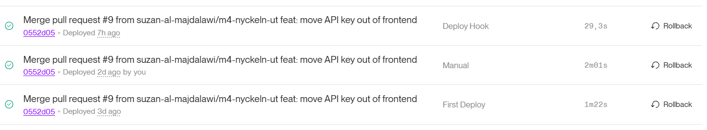

# Deploy -- Kraftly Mina sidor

## Flödet

```text
PR → CI → merge → GitHub Actions → publish image → GHCR → Render → verifiering
```

### CI/CD-flöde

1. En ändring pushas till GitHub och går genom CI.

2. När ändringen mergas till **`main`** bygger GitHub Actions Docker-imagen.

3. GitHub Actions publicerar imagen till GitHub Container Registry (GHCR).

4. Imagen publiceras som:

   ```text
   ghcr.io/suzan-al-majdalawi/kraftly-suzan-team:main
   ```

5. Render använder den publicerade imagen via **Existing Image**.

6. Render kör staging-versionen.

7. Deploy verifieras genom att kontrollera att rätt image/commit körs och att tjänsten svarar.

> **Obs:** För en Render-service som använder en prebuilt image från GHCR behöver en ny image normalt följas av en ny deploy/redeploy i Render. GitHub Actions bygger och pushar imagen, men det innebär inte automatiskt att Render byter till den nya imagen.

---

## Miljöer

| Miljö   | URL                     | Image                                                | API                     | Uppdateras                              |
| ------- | ----------------------- | ---------------------------------------------------- | ----------------------- | --------------------------------------- |
| Lokal   | `http://localhost:8080` | Lokal Docker-build                                   | `http://localhost:4000` | Manuellt med Docker Compose             |
| Staging | Render-URL              | `ghcr.io/suzan-al-majdalawi/kraftly-suzan-team:main` | Render API-URL          | GitHub Actions → GHCR → Render redeploy |

---

## Konfiguration -- var bor vad?

| Variabel                 | Hemlig? | Lokalt                    | Staging                                      | Används av         |
| ------------------------ | ------- | ------------------------- | -------------------------------------------- | ------------------ |
| **`API_KEY`**            | **Ja**  | `.env`                    | Render Environment                           | API + web/nginx    |
| **`API_URL`**            | Nej     | `http://localhost:4000`   | Render API-URL                               | web/nginx          |
| **`PORT`**               | Nej     | `80`                      | `10000` på nginx/Render                      | Render             |
| **`APP_ENV`**            | Nej     | `lokal` eller lokal miljö | `staging`                                    | web/runtime-config |
| **`RENDER_DEPLOY_HOOK`** | **Ja**  | Ej nödvändig              | GitHub Actions/secret om deploy hook används | GitHub Actions     |
| **`STAGING_URL`**        | Nej     | --                        | GitHub Actions/CI vid verifiering            | GitHub Actions     |
| **`GITHUB_TOKEN`**       | **Ja**  | --                        | GitHub Actions                               | GitHub/GHCR        |

### Lokalt

**`.env`** används endast lokalt och ska inte committas:

```env
API_KEY=lokal-utvecklingsnyckel
API_URL=http://localhost:4000
```

**`compose.yaml`** skickar bland annat följande till web-containern:

```yaml
environment:
  APP_ENV: staging
  API_URL: http://api:4000
  API_KEY: ${API_KEY:?API_KEY saknas – kör cp .env.example .env}
```

> **`API_KEY`** ska aldrig läggas i **`config.js`**, frontend-koden eller Git-historiken.

---

## Runtime-konfiguration

Frontend-imagen skapar **`config.js`** när nginx-containern startar.

Filen:

```text
docker/40-runtime-config.sh
```

skriver:

```javascript
window.__KRAFTLY__ = { env: "${APP_ENV:-lokal}" };
```

Det gör att samma Docker-image kan användas i olika miljöer utan att **`APP_ENV`** byggs in i frontend-imagen.

På staging ska:

```text
APP_ENV=staging
```

vara satt i Render.

---

## API-nyckeln

### Den gamla nyckeln

Den gamla API-nyckeln ska betraktas som förbrukad/ogiltig efter att den gav **`401 Unauthorized`** vid test med **`curl`**.

En **`401`** betyder att API inte accepterade den skickade autentiseringen. Den gamla nyckeln ska därför inte användas igen.

### Den nya nyckeln

Den nya nyckeln ska ligga som en secret/environment variable i den miljö där API körs, exempelvis:

```text
API_KEY=<nyckeln>
```

Den ska inte skrivas in i:

- Git
- **`compose.yaml`**
- frontend-kod
- **`config.js`**
- Docker-image
- README/DEPLOY-dokumentation

### Git-historiken

Om den gamla nyckeln någon gång har committats ska man utgå från att den är exponerad även om filen senare ändras.

Det säkraste är därför att **rotera/revokera den gamla nyckeln** och använda en ny secret.

Historik behöver inte skrivas om enbart för att byta en redan revokerad nyckel, men om en aktiv secret har läckt i Git-historiken bör historiken saneras enligt projektets säkerhetsrutiner och alla berörda secrets roteras.

> Lägg aldrig in den faktiska gamla eller nya API-nyckeln i denna fil.

---

## Rollback

### Sätt 1 -- Rollback till en tidigare Docker-image

1. Identifiera den tidigare fungerande image-taggen eller SHA.
2. Öppna Render-service.
3. Ändra image till den tidigare versionen, exempelvis en tidigare GHCR-image.
4. Spara ändringen.
5. Starta en ny deploy/redeploy.
6. Vänta tills Render visar att tjänsten är **`Live`**.
7. Kontrollera staging-URL.
8. Kontrollera att rätt version/commit körs via **`/version.txt`** om endpointen är tillgänglig.

### Sätt 2 -- Rollback genom Git

1. Identifiera den commit som var den senaste fungerande versionen.
2. Återställ/revertera ändringen i Git.
3. Pusha ändringen till **`main`**.
4. GitHub Actions kör CI och bygger en ny Docker-image.
5. Imagen publiceras till GHCR.
6. Deploya/redeploya Render.
7. Kontrollera staging-URL och **`/version.txt`**.
8. Kontrollera Render-loggarna efter deploy.

### Kontroll efter rollback

Rollbacken är genomförd när:

- Render visar tjänsten som **`Live`**.
- Staging-URL svarar.
- Applikationen laddas utan runtime-fel.
- API-anrop fungerar.
- **`/version.txt`** visar förväntad commit/version.
- Render-loggarna inte visar nya start- eller konfigurationsfel.

---

## Tider (uppmätta)

Fyll i dessa med de tider som faktiskt mättes under deployen. Använd inte uppskattningar som uppmätta värden.

| Steg                                   | Tid  |
| -------------------------------------- | ---- |
| Merge → GitHub Actions publish klar    | 10.6 |
| Deploy hook/redeploy → rätt SHA svarar | 29.3 |
| Totalt: merge → verifierad staging     | ___  |
| Kallstart                              | ___  |


---

## Kända begränsningar

### Kallstart

Render kan behöva starta om en tjänst efter inaktivitet. Det kan göra att första anropet tar längre tid än efterföljande anrop.

### Render-konto

Det behöver vara tydligt vem som äger och administrerar Render-kontot och vem som har behörighet att ändra staging-deployen.

### CPU-arkitektur

Render behöver köra en image som stöds av den aktuella plattformen. För denna deployment ska Docker-imagen vara byggd för:

```text
linux/amd64
```

Kontrollera GitHub Actions-builden om workflowet ändras så att en annan arkitektur används.

### Ingen produktion ännu

Det finns ingen etablerad produktionsmiljö ännu.

Nuvarande flöde är:

```text
GitHub
  ↓
GitHub Actions
  ↓
GHCR
  ↓
Render staging
```

Produktion ska inte betraktas som färdigkonfigurerad förrän separat produktionsmiljö, secrets, API och deploy/rollback-rutin är etablerade.

---

## Viktiga filer

| Fil                               | Syfte                                          |
| --------------------------------- | ---------------------------------------------- |
| **`Dockerfile`**                  | Bygger frontend/nginx-imagen                   |
| **`compose.yaml`**                | Lokal web + API                                |
| **`nginx.config.template`**       | nginx-konfiguration med runtime-variabler      |
| **`docker/40-runtime-config.sh`** | Skapar **`config.js`** vid containerstart      |
| **`.env`**                        | Lokala secrets/variabler -- ska inte committas |
| **`.env.example`**                | Exempel på lokala variabler                    |
| **`.github/workflows/`**          | CI/CD och publicering till GHCR                |

## GHCR-image

```text
ghcr.io/suzan-al-majdalawi/kraftly-suzan-team:main
```

Render ska använda **Existing Image** om målet är att Render ska köra den image som GitHub Actions redan har byggt och publicerat.
