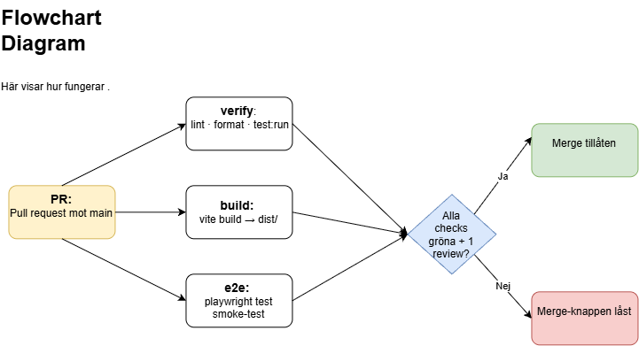
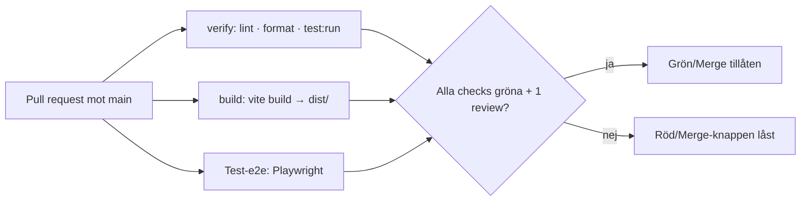

# Pipeline – Kraftly Mina sidor

## Flöde

skiss with draw.io

## Beslut 1 · Jobb: parallellt eller i serie?

Jobben körs parallellt eftersom verify, build och E2E-tester är oberoende av varandra.

Det gör att man inte behöver vänta på att ett jobb ska bli klart innan nästa startar. Den totala väntetiden för CI bestäms därför av det långsammaste jobbet.

## Beslut 2 · Vad krävs för merge?

Följande checks måste vara gröna (Requierd):

- Verify
- Build
- Test: E2E / Playwright

Dessutom krävs:

- 1 approval och review
- Branchen måste vara up to date
- Ingen bypass är tillåten

Om någon required check är röd kan PR:en inte mergas.

## Beslut 3 · Protokoll vid röd main

**Ansvarig:** Tech lead

**Tid:** Felet ska hanteras inom 45 min det viktyga behöves.

Vid ett större fel görs en **revert** för att snabbt återställa main.

Vid ett mindre fel lagas problemet direkt.

Man kringgår aldrig de required checks.

## Byggtid: före och efter npm-cache

Efter att `cache: npm` lades till i CI och Playwright-workflowen jämfördes körningarna före och efter ändringen.

| Workflow          | Utan cache |    Med cache |
| ----------------- | ---------: | -----------: |
| npm ci (verify)   |        26s |          32s |
| npm ci (build)    |        30s |          24s |
| Hela körningen    |      56s ? |        56s ? |
| ----------------  | ---------- | ------------ |
| CI                |       35 s |     **30 s** |
| Playwright (test) |     2.28 s |   **1.20 s** |

npm-cache gör att GitHub Actions kan återanvända nedladdade npm-paket mellan körningar. Det kan minska tiden för installationen av dependencies.

Resultatet kan variera mellan olika körningar eftersom GitHub Actions även påverkas av runner, cache-status och andra faktorer.

## Lokala tester

Playwright:

- 3 tester passerade
- Total tid: **2,9 s**

Vitest:

- 6 testfiler passerade
- 26 tester passerade
- Total tid: **1,15 s** sista kör mindre

## Skärmdumpar

Lokala tester:

[CI - Playwright / lokal ](img/local-test-playwright-10.png)

Utan cache:

[CI - Verify utan cache](img/verify-utan-cache-3.png)

[CI - Build utan cache](img/build_utan-cache-4.png)

[Playwright - Test utan cache](img/all-checks-passed-utan-cache-2.png)

[Actions - All workflows utan cache](img/actions-all-workflows-5.png)

Med cache:

[CI - Verify med cache](img/verify-med-cache-7.png)

[CI - Build med cache](img/build_med-cache-8.png)

[Playwright - Test med cache](img/all-checks-passed-med-cache-6.png)

[Actions - All workflows med cache](img/actions-all-workflows-med-cache-9.png)

## Skärmdump: låst merge-knapp

[låst merge-knapp](img/14.png)

### först så här och sen lös test med Requierd

[skärmbild.1](img/11.png)
[skärmbild.2](img/12.png)
[skärmbild.3](img/13.png)
[låst merge-knapp](img/14.png)
[skärmbild.5](img/15.png)
